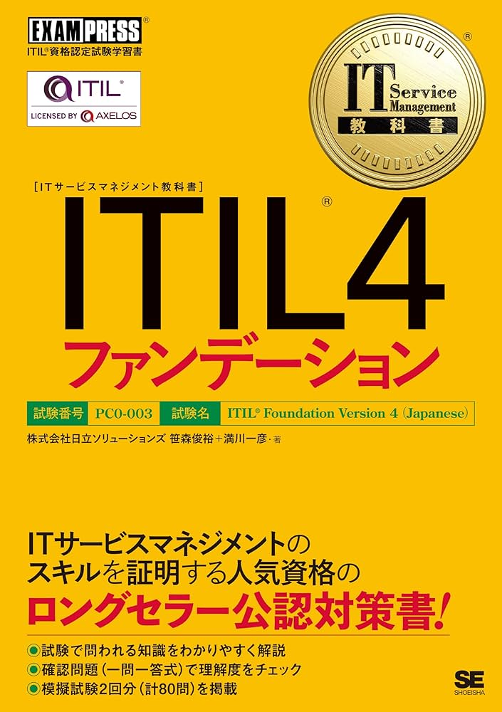

# 📚 ざっくばらん読書LT  
## 〜2024年に読んでよかった本たち〜  
kazu-mottan プレゼンツ！

---

## 今日の趣旨

📅 去年読んでよかった本・漫画を  
🍻 LTらしく、ざっくばらんに紹介！

**IT・ビジネス・人生観がちょっと変わるかも？**

---

## 📘 ITデューデリジェンスの実践ガイド

お気に入り度：★★★★☆

👤 **おすすめ：**  
ITコンサル / PM / 経営企画 / 新規事業部門

💡 **学びポイント：**
- カーブアウトやIT資産の定量評価に強い
- 「リスク」→ 存在よりも「どう管理してるか」
- 経営×現場をつなぐ実務視点が詰まってる

📚 [Amazonリンク](https://www.amazon.co.jp/dp/4502470910)

---

## 🔧 ITIL v4 Foundation

お気に入り度：★★★☆☆

👤 **おすすめ：**  
SIer / 情シス / IT運用系の人すべて！

💡 **注目ポイント：**
- ITサービスを"仕組み"として捉える
- SVSやバリューストリームなど今風な概念
- 「作法」→「顧客価値を届ける手段」として理解できる

📚 [翔泳社リンク](https://www.shoeisha.co.jp/book/detail/9784798172046)

---

## 🎬 仕事道楽  
### 〜スタジオジブリの現場〜

お気に入り度：★★★★☆（ジブリ好きは★4.5）

👤 **おすすめ：**  
マネージャー / プロデューサー / クリエイティブ職

💡 **刺さった教え：**
- 最大の理解者 = イエスマンではない
- 仕事と遊びの境界をなくす
- 「誰のために作るか」がクリエイティブの軸

📚 [Amazonリンク](https://www.amazon.co.jp/dp/4004314860)

---

## 👁 1984年（ジョージ・オーウェル）

お気に入り度：★★★★☆

👤 **おすすめ：**  
SF / 社会思想 / AI・プロパガンダ好きな人へ

💡 **印象的だったところ：**
- 言語改革「ニュースピーク」= 思考の支配
- SNS・AI社会の怖さとつながる
- まるで近未来の予言書…

📚 [新訳版 Amazonリンク](https://www.amazon.co.jp/dp/4041092450)

---

## 🟦 転生したらスライムだった件

お気に入り度：★★★★★

👤 **おすすめ：**  
アニメ・ラノベ好きビジネスマン / マネージャー

💡 **意外な学び：**
- リムルのリーダーシップ = 心理的安全性！
- 多様性を受け入れて強みに変える
- マネジメント教科書として読める異世界転生ラノベ

📚 [Amazonリンク](https://www.amazon.co.jp/dp/B07NC99TBP)

---

## 📱 毎日連続100本アプリを作ったら人生が変わった（2025）

お気に入り度：★★★★★

👤 **おすすめ：**  
エンジニア / 個人開発者 / アプリ開発に興味がある人

💡 **印象的なポイント：**
- ゆるコンピューターラジオのPRでおすすめしてた本
- ChatGPTは使い手の能力以上のことはできない
- 自己啓発本でもあれば、学習本

📚 [Amazonリンク](https://amzn.asia/d/i7MLfU4)

--- 

## 🌸 あおざくら(2023)

お気に入り度：★★★★★

👤 **おすすめ：**  
筋肉脳 / 理不尽な世界 / 防衛大に入りたい方

💡 **心に残ったこと：**
- 吉田さん、（飯山さん）におすすめされた本
- 青春と理不尽にありふれたもの
- この理不尽に比べたら僕の仕事はちっぽけだとこと

📚 [Amazonリンク](https://amzn.asia/d/ibI7KlZ)

---

## 🔚 まとめ

| 本 | ジャンル | 一言 |
|----|----------|------|
| ITデューデリジェンス | M&A実務 | 現場×経営の視点が学べる |
| ITIL v4 | IT運用 | モダンな運用フレームが体系化 |
| 仕事道楽 | 組織論 / ジブリ | 遊び心と熱意のマネジ論 |
| 1984年 | ディストピアSF | 思考を奪う社会の恐ろしさ |
| 転スラ | 異世界×組織論 | 心理的安全性×異世界国家運営 |
| 毎日連続100本アプリ | 個人開発実践 | 小さく始めて大きく育てる |
| あおざくら | 医療漫画 | 命と向き合う仕事の重み |

---

## 🙇‍♂️ ご清聴ありがとうございました！

📣 推し本あったらぜひ教えてください〜  
📮 気になった本があれば、あとでリンク送ります！

LT by kazu-mottan ☕
